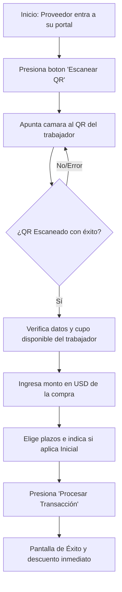

# 📖 Manual de Uso para Comercios Aliados (Proveedores) · CrediCRC

¡Bienvenido al ecosistema financiero de **CrediCRC**! Este manual ha sido diseñado para guiarte paso a paso en cómo realizar ventas y gestionar tus operaciones dentro de la plataforma de forma rápida, segura y cómoda.

---

## 🚀 Índice
1. [Acceso al Portal de Proveedores](#-1-acceso-al-portal-de-proveedores)
2. [Cómo Procesar una Venta (Flujo de Escaneo QR)](#-2-c%C3%B3mo-procesar-una-venta-flujo-de-escaneo-qr)
3. [Control e Historial de Ventas](#-3-control-e-historial-de-ventas)
4. [Gestión y Actualización del Perfil Comercial](#-4-gesti%C3%B3n-y-actualizaci%C3%B3n-del-perfil-comercial)
5. [Recomendaciones y Buenas Prácticas](#-5-recomendaciones-y-buenas-pr%C3%A1cticas)

---

## 📦 1. Acceso al Portal de Proveedores

Para ingresar a tu cuenta de comercio aliado, sigue estos sencillos pasos:

1. Abre tu navegador web en el teléfono, tablet o computadora e ingresa a: **[credicrc.app](https://credicrc.app)**
2. En la parte superior de la página de inicio, selecciona la pestaña **"Proveedor"**.
3. Ingresa tu correo electrónico registrado y contraseña de comercio.
4. Presiona el botón azul **"Ingresar al Portal"**.

> 💡 **Tip:** Si utilizas un dispositivo móvil Android o una computadora con Google Chrome/Edge, puedes presionar el botón dorado **"Instalar App"** en el encabezado para descargar un acceso directo directo en tu pantalla de inicio como una aplicación nativa.

---

## 🛒 2. Cómo Procesar una Venta (Flujo de Escaneo QR)

Este es el proceso para procesar una compra utilizando el QR digital del trabajador:

### Paso 1: Activar el Escáner
En la sección principal de tu portal de Proveedor, presiona el botón verde grande que dice **"📷 ESCANEAR QR"**. Esto abrirá la cámara de tu dispositivo.

### Paso 2: Escanear el QR del Cliente
Pídele al trabajador del colegio que te muestre su **Código QR de Identidad** desde su propio portal de CrediCRC. Apunta la cámara de tu dispositivo hacia su pantalla. El escáner lo reconocerá de forma inmediata.

### Paso 3: Verificar los Datos del Trabajador
Una vez escaneado, la plataforma mostrará en pantalla la ficha del cliente:
* **Nombre y Cédula de Identidad**
* **Nivel de Fidelidad** (Bronce, Plata, Oro, etc.)
* **Límite de Crédito Disponible** (Verifica que cuente con fondos suficientes en USD para cubrir la compra).

### Paso 4: Cargar la Venta
1. **Monto de la Venta ($):** Escribe el valor neto de la compra en dólares (USD). La plataforma calculará automáticamente el equivalente en bolívares (Bs.) en base a la **Tasa Oficial del Banco Central de Venezuela (BCV)**.
2. **Financiamiento:** Elige los días de plazo para el cobro (por defecto son 15 días).
3. **Monto de la Inicial (⚠️ OPCIONAL):** De acuerdo al nivel del trabajador, la plataforma sugerirá un % de inicial. **El cobro de esta inicial es completamente opcional.** Si el trabajador no desea pagar inicial o tú decides exonerarla, simplemente desmarca la casilla **"Aplicar Inicial"** y el sistema financiará el 100% de la venta directamente. Si deciden aplicarla y te la paga en caja, marca la casilla correspondiente.
4. Presiona el botón verde **"Procesar Transacción"**.

¡Listo! Aparecerá una pantalla de confirmación y el saldo del trabajador se descontará inmediatamente, registrando la venta en tu historial.

---

## 📊 3. Control e Historial de Ventas

En tu portal principal tienes acceso a la pestaña para llevar la contabilidad al día:

* **Historial de Ventas:** Visualiza en tiempo real la lista de todas las compras realizadas por el personal del colegio, ordenadas de la más reciente a la más antigua, con el nombre del cliente, la fecha exacta de la compra, el nro. de referencia y el monto cobrado en dólares (USD).
* **Control Interno:** Cada registro exitoso se muestra inmediatamente para que puedas validar que la venta fue procesada correctamente por el sistema.

---

## ⚙️ 4. Gestión y Actualización del Perfil Comercial

Es fundamental mantener actualizados los datos donde el colegio te transferirá las ganancias:

1. Dirígete a la pestaña **"Mi Perfil / Datos de Pago"**.
2. Rellena o edita los siguientes datos según sea el caso:
   * **Nombre Comercial y Categoría.**
   * **RIF de la Empresa.**
   * **Datos de Pago Móvil:** Banco, Teléfono asociado y Cédula/RIF del titular.
   * **Cuenta Bancaria (Transferencia).**
   * **Logo Comercial:** Sube una foto de tu logo para que los trabajadores lo reconozcan en la app de manera más familiar.
3. Presiona **"Guardar Cambios"**.

---

## 📌 5. Recommendations y Buenas Prácticas

* **Control de Cuentas Claras:** Nunca entregues mercancía si la aplicación no te muestra la pantalla verde de **"Operación Aprobada"**. Si tienes dudas, revisa tu historial de ventas recientes en la misma pantalla.
* **Cobro de la Inicial (Opcional):** Recuerda que cobrar la inicial es una opción. Si el cliente decide pagarla, asegúrate de recibir el dinero físico o pago móvil antes de marcar la confirmación de la transacción.
* **Estabilidad de Red:** Si estás en una zona con datos móviles lentos, te sugerimos utilizar la red Wi-Fi de tu establecimiento para que el escaneo y el registro de la venta sean instantáneos.
